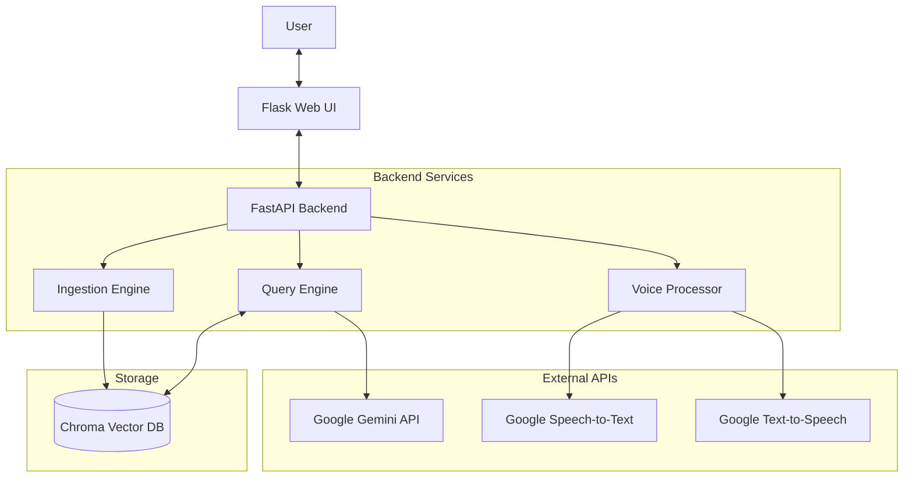
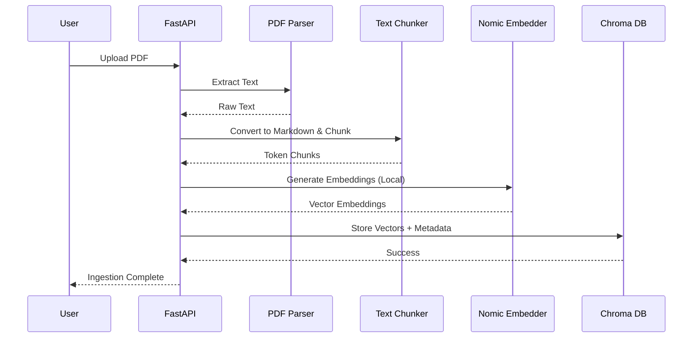
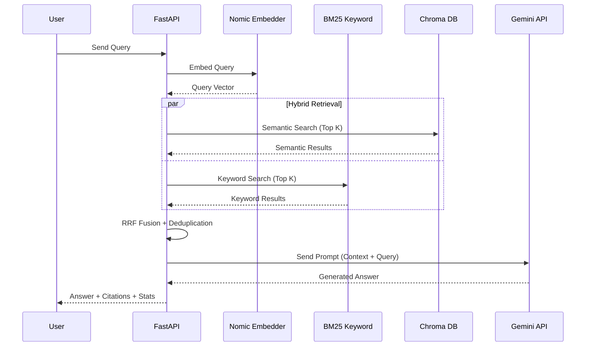
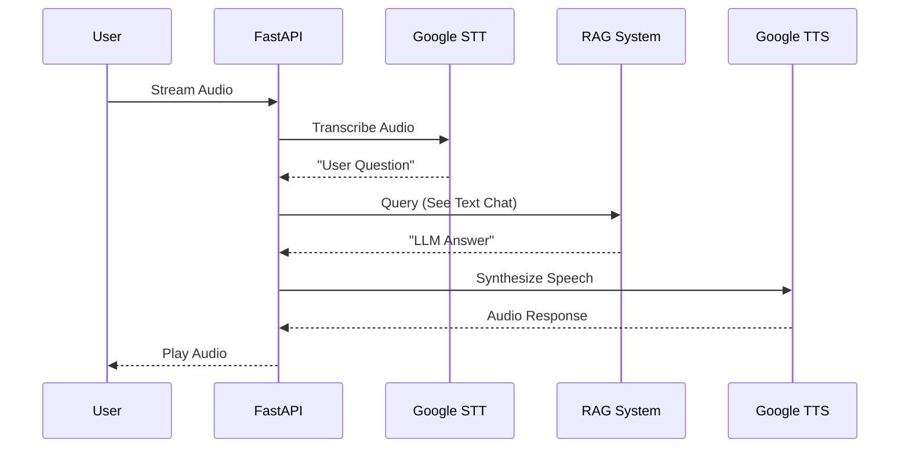

# Local RAG Chatbot

A local-first Retrieval-Augmented Generation (RAG) system that ingests PDFs, embeds chunks locally with `nomic-embed-text-v1`, stores them in a local Chroma vector database, and answers user queries by retrieving relevant chunks and sending only those to Google Gemini for final response generation.

## 🎯 Key Features

- **Local-first**: All document text and embeddings stay on your machine during ingestion
- **Hybrid Search**: Combines semantic (vector) and keyword (BM25) retrieval with RRF fusion
- **Three Retrieval Modes**: `hybrid`, `keyword`, or `semantic` — configurable via environment
- **PDF ingestion**: PyMuPDF-based PDF parsing with Markdown conversion
- **Batch Upload**: Upload multiple PDFs simultaneously for efficient processing
- **Local embeddings**: nomic-embed-text-v1 or Gemini embeddings (configurable)
- **Vector storage**: Chroma DB with duckdb+parquet persistence
- **Cloud LLM**: Google Gemini for answer generation (only retrieved chunks are sent)
- **Duplicate Detection**: Filters near-duplicate chunks (85% similarity threshold)
- **Voice Interaction**: Speech-to-text and text-to-speech for natural conversations
- **API + UI**: FastAPI backend with Flask web interface

## 📋 Architecture

### 1. System Overview



### 2. Ingestion Pipeline



### 3. Text Chat Flow (Hybrid Search)



### 4. Voice Interaction Flow



## 🔧 Prerequisites

- Python 3.9 or higher
- Google Gemini API key ([Get one here](https://makersuite.google.com/app/apikey))
- ~500MB disk space for embedding model
- **FFmpeg** (required for voice features — audio format conversion)
- Optional: CUDA-capable GPU for faster embeddings

### Installing FFmpeg

**Windows:**
```powershell
choco install ffmpeg
# Or download from https://ffmpeg.org/download.html and add to PATH
```

**macOS:**
```bash
brew install ffmpeg
```

**Linux (Ubuntu/Debian):**
```bash
sudo apt update && sudo apt install ffmpeg
```

**Verify installation:**
```bash
ffmpeg -version
```

## 📦 Installation

### 1. Clone or download this repository

```bash
cd Rag-chatbot
```

### 2. Create virtual environment (recommended)

```bash
python -m venv venv

# Windows (PowerShell)
venv\Scripts\Activate.ps1

# macOS/Linux
source venv/bin/activate
```

### 3. Install dependencies

```bash
pip install -r requirements.txt
```

### 4. Download the embedding model

```bash
python download_model.py
```

This will download the `nomic-embed-text-v1` model (~100-500MB). The model is required before running the application.

## ⚙️ Configuration

### 1. Set up environment variables

```bash
# Windows (PowerShell)
Copy-Item .env.example .env

# macOS/Linux
cp .env.example .env
```

### 2. Edit `.env` file

```bash
# Required
GOOGLE_API_KEY=your_actual_api_key_here

# Optional: Custom paths
CHROMA_PERSIST_DIR=./chroma_data
EMBEDDING_MODEL_PATH=./models/nomic-embed-text-v1

# Embedding Provider: 'auto', 'gemini', or 'local'
EMBEDDING_PROVIDER=local

# Query Configuration
RETRIEVAL_K=10              # Number of chunks to retrieve (default: 5)
LLM_TEMPERATURE=0.3         # Lower = more factual (default: 0.3)
DUPLICATE_THRESHOLD=0.85    # Similarity threshold for deduplication

# Retrieval Mode: 'hybrid', 'keyword', or 'semantic'
RETRIEVAL_MODE=hybrid
RRF_K=60                    # RRF fusion constant (default: 60)
```

## 🚀 Running the Application

### Start the FastAPI backend

```bash
python -m uvicorn backend.app:app --reload
```

API available at `http://localhost:8000` — Swagger docs at `http://localhost:8000/docs`

### Start the Flask UI (in separate terminal)

```bash
python ui_flask/app.py
```

UI available at `http://localhost:5000`

- Chat interface: `http://localhost:5000/chat`
- Voice chat: `http://localhost:5000/voice`
- Upload documents: `http://localhost:5000/upload`
- Document library: `http://localhost:5000/documents`

### HTTPS Configuration (Required for Voice on Remote Access)

Voice features require HTTPS when accessed from non-localhost addresses (browsers block microphone access on HTTP). Set `HTTPS_ENABLED=true` in your `.env` to auto-generate a self-signed certificate.

## 💡 Using the Application

### Text-based Chat

1. **Upload PDFs**: Navigate to "Upload" and select PDF files
2. **Wait for processing**: System parses, chunks, and embeds your documents locally
3. **Ask questions**: Go to "Chat" and type your questions
4. **Review answers**: Get answers with citations and source chunks

### Voice Interaction

1. Navigate to "Voice Chat" (`http://localhost:5000/voice`)
2. Click the microphone button and speak your question
3. Click stop when finished — AI processes and responds with synthesized voice
4. All voice queries access your uploaded documents via RAG

**Technical Details:**
- Speech-to-Text: Google Speech Recognition
- Text-to-Speech: gTTS
- Audio: WebM/Opus input, MP3 output
- Requires: Chrome 70+, Firefox 65+, Edge 79+, or Safari 14.1+

**Privacy Note:** Voice data is processed through Google services. Audio is not stored permanently. Use text chat for maximum privacy.

## 🧪 Testing

```bash
# Run all tests
pytest backend/tests/ -v

# Run with coverage
pytest backend/tests/ --cov=backend --cov-report=html
```

**Current test coverage:**
- ✅ Embedder: encoding, normalization, consistency
- ✅ Chunker: token-based splitting, overlap validation
- ✅ Markdown converter: heading/list preservation
- ✅ Chroma DB: CRUD operations
- ⚠️ Integration tests: Require sample PDFs and gold Q&A data

## 🔒 Security & Privacy

**Stays local:**
- All PDF content during ingestion
- All embeddings (never sent to cloud)
- Vector database (stored in `./chroma_data`)

**Sent to cloud:**
- Top retrieved chunks + user query → Google Gemini
- Voice audio → Google Speech Recognition / TTS

**Recommendations:**
- Use `.env` for API keys (never commit to git)
- Redact sensitive information before uploading PDFs

## ⚠️ Known Limitations

1. **No OCR support**: Image-only or scanned PDFs will fail — text-based PDFs only.
2. **Single-user**: No authentication or multi-tenancy.
3. **English-focused**: Tokenizer and retrieval tuned for English text.

## 📊 Performance

- **Ingestion**: ~1 PDF (10 pages) per minute (CPU-only)
- **Retrieval**: <200ms for local embedding + vector search
- **Total query latency**: <2s retrieval + Gemini API time

## 🛠️ Troubleshooting

### "Cannot connect to API server"
- Ensure FastAPI is running: `python -m uvicorn backend.app:app --reload`
- Check port 8000 is free

### "GOOGLE_API_KEY not set"
- Create `.env` from `.env.example` and add your key

### "Failed to extract page X: image-only"
- Page contains only images — OCR is not supported

### Voice recording not working
- Grant microphone permission in browser
- Use HTTPS or localhost (required for Web Audio API)
- Chrome is recommended

### "Audio file could not be read"
- Ensure FFmpeg is installed and in your PATH (see Prerequisites)

### TLS/SSL errors or voice protocol errors
- If accessing from a remote device, enable HTTPS with `HTTPS_ENABLED=true`
- Ensure clients aren't auto-upgrading HTTP to HTTPS (clear HSTS cache if needed)

## 🔄 Development

### Modifying chunk size or overlap

Edit `backend/ingest.py`:

```python
self.chunker = TextChunker(
    chunk_size=400,  # Change this
    overlap=50       # Change this
)
```

## 📝 License

[MIT License](LICENSE)
